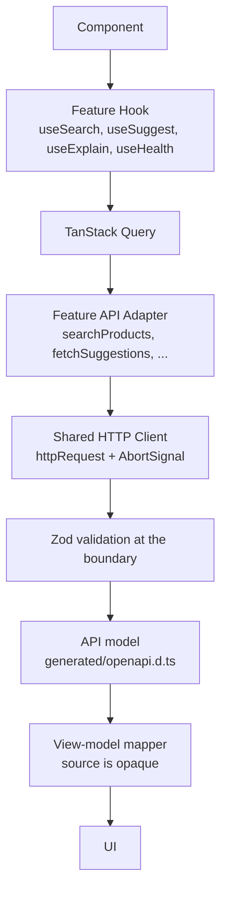

# API Integration Pipeline

This document describes the path a request takes from a React
component to the backend and back. It complements `architecture.md`,
which describes the layer rules; this one describes the flow through
them.

## The Pipeline

The pipeline is strict: no stage skips the one below it. A component
does not call `fetch`; a hook does not parse JSON; a mapper does not
know about HTTP.

## Stage by Stage

### 1. Component

A component receives callbacks from its parent and emits events. It
does not know whether the data came from a network or from a cache.

### 2. Feature Hook

Each feature exposes exactly one data hook (`useSearch`,
`useSuggest`, `useExplain`, `useHealth`). The hook is responsible
for the query key, `enabled` state, retry policy, and stale time.
It returns the shape TanStack Query gives back.

### 3. TanStack Query

Query owns caching, refetching, and cancellation. Its key is derived
from the URL state (for search) or from the request parameters (for
the others), so identical requests share a cache entry.

### 4. Feature API Adapter

The adapter lives in `features/<name>/api/<name>-api.ts`. It:

1. Validates the request with the request Zod schema.
2. Calls `httpRequest` with the path, method, and body.
3. Validates the response with the response Zod schema.

If the backend returns a body that does not match the schema, the
adapter throws a Zod error. The UI never renders an unvalidated
shape.

### 5. Shared HTTP Client

`shared/api/http-client.ts` wraps `fetch`. It:

- prepends `VITE_API_BASE_URL` (empty in development, so the Vite
  proxy handles the request)
- sets `Accept: application/json` and `Content-Type` on POST
- forwards the `AbortSignal` from TanStack Query
- parses the body as JSON (or returns `undefined` on empty)
- maps non-2xx responses and network failures to an `ApiError`

The client is the only place in the codebase that calls `fetch`.

### 6. Error Mapping

Every failure is mapped to `ApiError` with a stable `code`:

| Source                                 | Code                  |
| -------------------------------------- | --------------------- |
| 400 with `error.code: invalid_request` | `invalid_request`     |
| 404                                    | `not_found`           |
| 503                                    | `backend_unavailable` |
| 504                                    | `backend_timeout`     |
| 500                                    | `internal_error`      |
| `fetch` threw                          | `network_error`       |
| Body was not JSON                      | `unknown_error`       |

The retry policy (`shared/api/retry-policy.ts`) reads the code:
client errors are not retried; transient backend failures are retried
once. `AbortError` is never retried.

### 7. View-Model Mapper

The backend documents `source` as opaque (its fields may change
without notice). A mapper per feature reads the fields it knows
defensively and produces a view model the UI can rely on. Missing
fields become `null`; the UI is expected to handle every optional
field.

## What Each Stage Does Not Do

- The component does not fetch.
- The hook does not build a URL or parse JSON.
- The adapter does not know about React.
- The HTTP client does not know about Zod, features, or view models.
- The mapper does not know about HTTP or caching.

## Adding a New Endpoint

1. Add the OpenAPI-derived type by regenerating `openapi.d.ts`
   (`pnpm generate:api-types`).
2. Write a Zod schema in `shared/api/schemas/<name>.ts`.
3. Write the adapter in `features/<feature>/api/<name>-api.ts`.
4. Write the hook next to the adapter.
5. Add an MSW handler in `src/test/msw/handlers.ts` for tests.
6. Add fixtures in `src/test/fixtures/api-responses.ts`.
7. If the endpoint has a view-model shape, add a mapper under
   `features/<feature>/lib/`.
