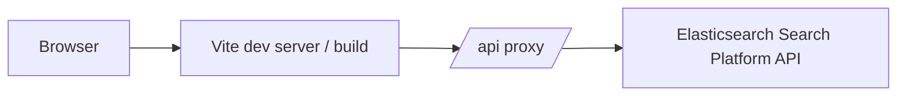
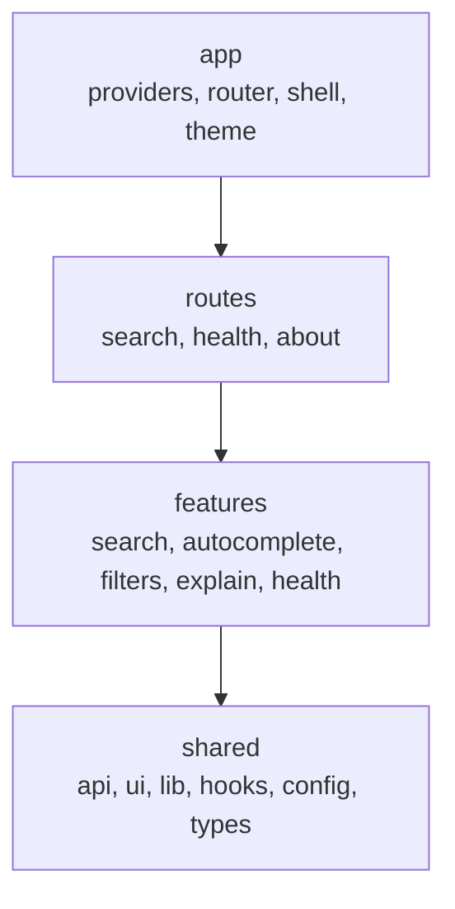
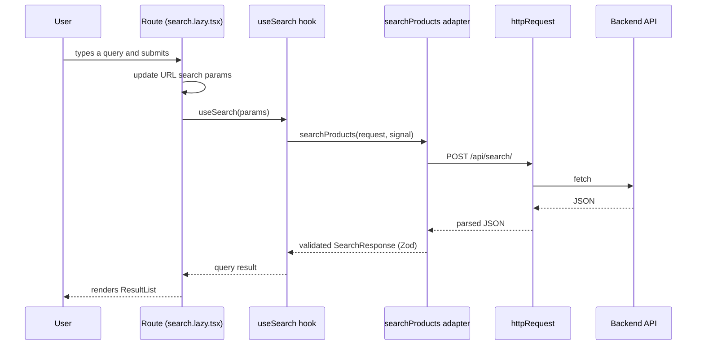

# Architecture

This document describes how Search Lens is organized and why. It
summarizes the decisions recorded in the ADRs and points at the code
that enforces them.

## High-Level View



In development the Vite dev server proxies `/api/*` to
`http://localhost:8000`. In production the deployment is expected to
place a reverse proxy in front of the frontend assets and the API
origin; the frontend uses relative URLs when `VITE_API_BASE_URL` is
unset.

## Layers

The source tree is divided into four layers with a one-way dependency
direction:



A layer may only depend on layers to its right. The rules are
enforced by dependency-cruiser and ESLint (see ADR-001).

## Anatomy of a Feature

Every feature follows the same four-folder shape:

```
features/<name>/
  api/     HTTP adapter and TanStack Query hook
  model/   view models and mappers (when needed)
  lib/     pure helpers that are not React
  ui/      React components
```

The `api/` folder is the only place a feature talks to the network.
It calls `httpRequest` from `shared/api/http-client.ts` and validates
the response with a Zod schema from `shared/api/schemas/`.

The `ui/` folder is presentational. Components receive data as props
and call callbacks on interaction. They do not fetch.

## Data Flow

A search request travels through five stages:



The route is the only place that writes to the URL. The hook is the
only place that calls the adapter. The adapter is the only place that
knows the wire shape.

## State Model

State lives in exactly three places:

| Place          | What lives there                                             | Reference |
| -------------- | ------------------------------------------------------------ | --------- |
| URL            | query, filters, sort, page                                   | ADR-003   |
| TanStack Query | server data (search, suggest, explain, health)               | -         |
| React local    | draft query, drawer open/close, expanded nodes, mobile sheet | -         |

There is no global store. If two components need the same value and
it is not server data, one of them owns it and passes it down.

Cursor is never in the URL (ADR-004). It is either not used at all
in the current UI, or carried in transient state that is tied to the
active query.

## Testing Strategy

| Layer         | Tool                     | What it covers                              |
| ------------- | ------------------------ | ------------------------------------------- |
| Zod schemas   | Vitest                   | Wire-shape validation and cross-field rules |
| URL model     | Vitest                   | Parse, serialize, roundtrip                 |
| Hooks         | Vitest + MSW             | Fetching, caching, retry, debounce          |
| Primitives    | Vitest + Testing Library | Accessibility and behavior                  |
| Features (UI) | Vitest + Testing Library | Composition and callbacks                   |
| End-to-end    | Playwright               | Journeys through a real browser             |

E2E tests mock the API at the network boundary with `page.route`, so
they run without a live backend or Elasticsearch cluster. The mocked
responses mirror the real wire shape and are kept in
`e2e/helpers.ts`.

## Enforcement

The architecture is not a document; it is a set of checks:

- `pnpm arch` (dependency-cruiser) rejects layer violations.
- `pnpm lint` rejects restricted imports at the file level, with
  better error messages in the editor.
- `pnpm typecheck` rejects shape drift between the OpenAPI schema and
  the frontend types.
- The Vitest suite contains an architecture test that runs `pnpm arch`
  inside the test runner, so a violation fails the same command as a
  behavior regression.

## Where to Look

- Architecture decisions: `docs/adr/`.
- API contract: `src/shared/api/schemas/` (runtime) and
  `src/shared/api/generated/openapi.d.ts` (compile time).
- Shared constants: `src/shared/config/search-constants.ts`.
- URL model: `src/shared/lib/search-params.ts`.
- HTTP client: `src/shared/api/http-client.ts`.
- Canonical errors: `src/shared/api/api-error.ts`.
